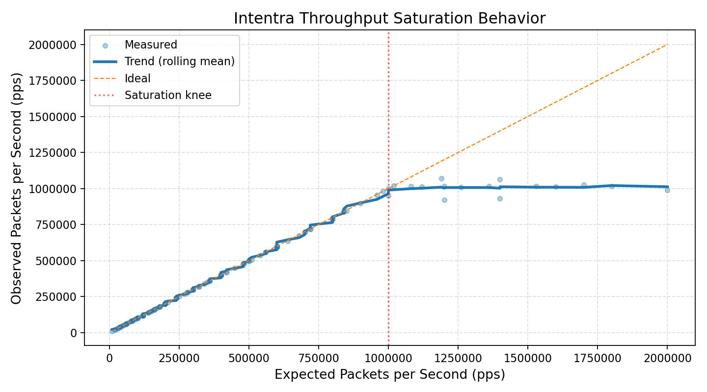
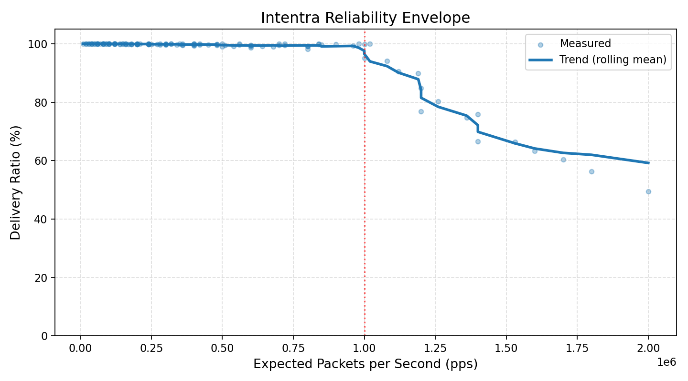

# intentra

> **Q: What is intentra?**
> A deterministic, multi-peer UDP transport for **real-time state distribution** in private networks.

> **Q: What problem does it solve?**
> Sending **lots of small updates** to **many peers** with **low latency**, where **drops are OK but stalls are not**.

---

## What intentra is good at

> **Q: What does it do well?**

* Multi-peer UDP (thousands of peers, one socket)
* Deterministic packet processing (no head-of-line blocking)
* Graceful overload (drops instead of freezing)
* Single-threaded, predictable behavior

> **Security?**

* AES-256-GCM per packet
* Noise (X25519) handshake with stateless cookies
* Per-peer rate limiting (10k pps)
* Replay protection (64-bit window)
* Authenticated ACKs

> **Can I observe what’s happening?**

Yes. Metrics are **always on** (Prometheus format):
rate-limit drops, crypto failures, handshake pressure — all visible.

---

## What intentra is *not*

> **Is this a TLS / QUIC replacement?**
> No.

> **Can I expose this directly to the public internet?**
> No — you need a firewall.

> **Does it guarantee zero packet loss?**
> No — it guarantees **no stalls**.

> **Is this an RPC or streaming framework?**
> No — it moves packets, fast.

---

## Where it shines

> **Best-fit workloads**

* Robotics fleet telemetry
* Real-time simulations / digital twins
* Multiplayer game state replication
* Private market data feeds

> **Bad fit**

* Public APIs
* File transfer
* RPC / microservices
* Anything needing strict reliability

---

## How fast is it really?

> **Measured, not theoretical**

* 128-byte packets
* 120s per test
* 2 senders

**What we see:**

* Up to **~1,000,000 packets/sec** → **≥99% delivery**
* Around **~1.2M pps** → delivery starts degrading
* Above that → smooth drops, no collapse

Example:

* **2,000 peers @ 500 Hz** → ~1M PPS @ **99.99% delivery**
* **1,500 peers @ 800 Hz** → ~1.2M PPS @ **~88% delivery**

Failure mode: **CPU saturation**, not protocol failure.

---

## Measured performance

### Throughput accuracy & saturation



This shows how closely intentra tracks the requested packet rate and where
single-core saturation begins.

### Reliability envelope



This shows delivery ratio as load increases. Degradation is smooth and
predictable — no stalls or collapse.

---

## How should I run it?

> **Recommended defaults**

* State rate: **200 Hz**
* High-performance tier: **500 Hz**
* Shard after **100–250 peers per instance**

Scaling is done by **running more intentra instances**, not by pushing one harder.

---

## Quick start

```rust
use intentra::transport::Transport;

fn main() -> std::io::Result<()> {
    let mut t = Transport::bind("127.0.0.1:9000", false)?;
    t.run(); // blocks
    Ok(())
}
```

---

## Security model (short version)

> **What intentra protects against**

* Replay attacks
* ACK floods
* Handshake floods
* Malformed packets

> **What it doesn’t**

* Volumetric DDoS
* Compromised keys
* Application-level bugs

Firewall + monitoring are mandatory.

---

## Versioning

> **Is the API stable?**
> No. v0.x is **intentionally unstable**.

Expect improvements and breaking changes before 1.0.

---

## License

MIT OR Apache-2.0
Your choice.

---

### One-line takeaway

> **intentra is for real-time systems that prefer dropping packets over dropping frames.**
